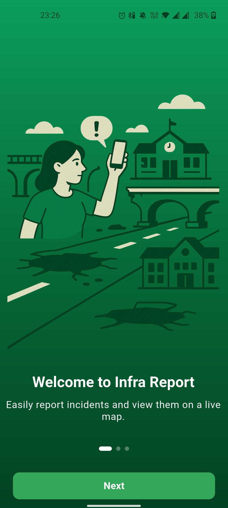
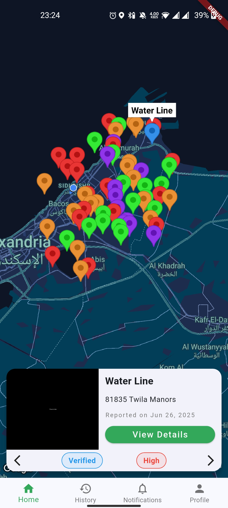
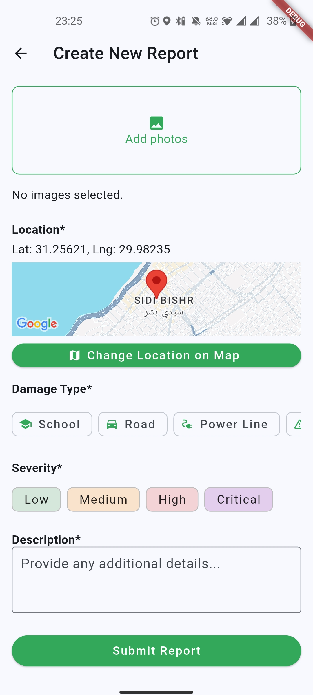
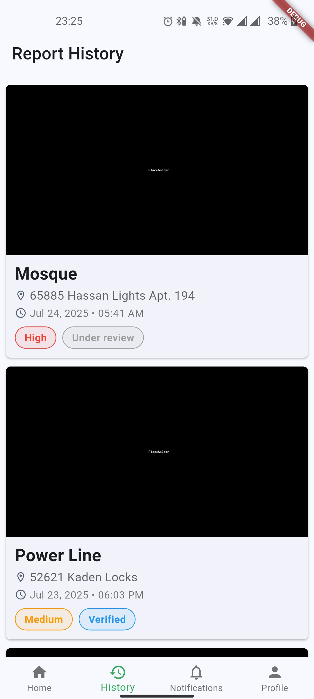
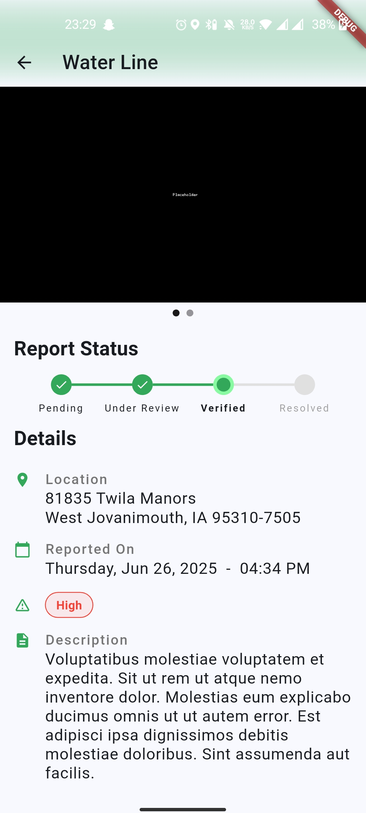

# Infra Report – Mobile App

## Screenshots
| Onboarding | Home Screen | Submit Report form | Report History | report detail |
|-------------|-------------|--------------|--------------|--------------|
|  |  |  |  |  |

## Download
you can download the APK for release version from [here](https://github.com/Almadih/infra-report-app/releases/latest)

## Overview
Infra Report is a **Flutter-based mobile application** that empowers citizens to report damaged infrastructure in Sudan. By submitting geotagged photos and descriptions, users contribute to a crowdsourced database that helps prioritize repair and reconstruction efforts.

---

## Inspiration
After two years of devastating war in Sudan, countless roads, bridges, schools, and other vital infrastructure have been destroyed or severely damaged. This mobile app is inspired by the belief that every citizen can play an active role in rebuilding the nation. It provides a simple yet powerful platform to ensure that no damage goes unnoticed.

---

## What It Does
- Allows citizens to **report damaged infrastructure** with photos and location data.
- Works **offline** by storing reports locally (using Drift/SQLite) until an internet connection is available.
- Automatically syncs data with the backend once online.

---

## How We Built It
- Developed with **Flutter** for a seamless cross-platform experience.
- Integrated with **GPS** and **camera** APIs for geotagged photo submissions.
- Implemented **offline caching** using Drift/SQLite to store reports temporarily.
- Built a clean and **user-friendly interface** for quick report submissions.

---

## Challenges We Ran Into
- Handling **offline scenarios** and ensuring smooth synchronization.
- Maintaining **accuracy** and preventing duplicate reports.

---

## Accomplishments We're Proud Of
- Delivered a fully functional, intuitive **Flutter app** in a short timeframe.
- Integrated **geotagging** for precise damage locations.
- Designed an **offline-first architecture** for war-affected regions.

---

## What We Learned
- Gained advanced experience in **offline-first Flutter apps** with Drift/SQLite.
- Learned how to build a **robust and efficient geolocation workflow**.
- Optimized image handling and storage for low-bandwidth areas.

---

## What's Next
- Integrate **AI-powered damage assessment** directly in the app.
- Add **community features** such as report upvoting and verification.
- Improve **offline experience** with better caching and conflict resolution.

---

## Tech Stack
- **Framework:** Flutter (Dart)
- **Local Storage:** Drift/SQLite
- **Geolocation & Camera:** Flutter plugins (geolocator, image_picker)

---

## Getting Started
### Prerequisites
- [Flutter SDK](https://flutter.dev/docs/get-started/install)
- Android Studio or Xcode

### Installation
```bash
git clone https://github.com/yourusername/infra-report-mobile.git
cd infra-report-mobile
flutter pub get
flutter run
```

Dashboard source code is available at [infra report](https://github.com/Almadih/infra-report-dashboard)
